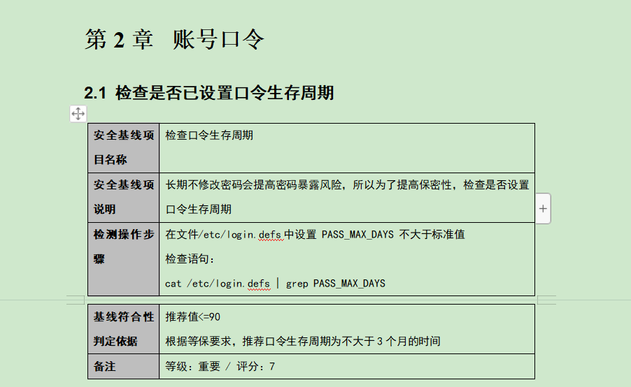

# Baseline Check list
Linux/Windows 基线检查，配套自动化检查脚本。

# 基线配置文档
本文规定了LINUX操作系统主机应当遵循的操作系统安全性设置标准，本文档旨在指导系统管理人员或安全检查人员进行LINUX 操作系统的安全合规性检查和配置。

服务器安全基线是指为满足安全规范要求，考虑到信息安全管理的三+四个特性：保密性、完整性、可用性、可审计性、可靠性、抗抵赖性。

服务器安全配置必须达到的标准，一般通过检查安全配置参数是否符合安全标准或公司标准来度量。主要包括了账号配置安全、口令配置安全、授权配置、日志配置、IP通信配置等方面内容，这些安全配置直接反映了系统自身的安全脆弱性。



# Linux
```shell
chmod +x checklist.sh
sudo ./checklist.sh
```


运行完成后生成checklist.csv文件


为了更加方便阅读，请对其进行分列，按照tab键进行分列。

# Windows
使用Powershell运行
```powershell
.\checklist.ps1
```

运行报错解决


```powershell
set-ExecutionPolicy RemoteSigned
```


运行截图


运行完成后生成ip.csv文件


